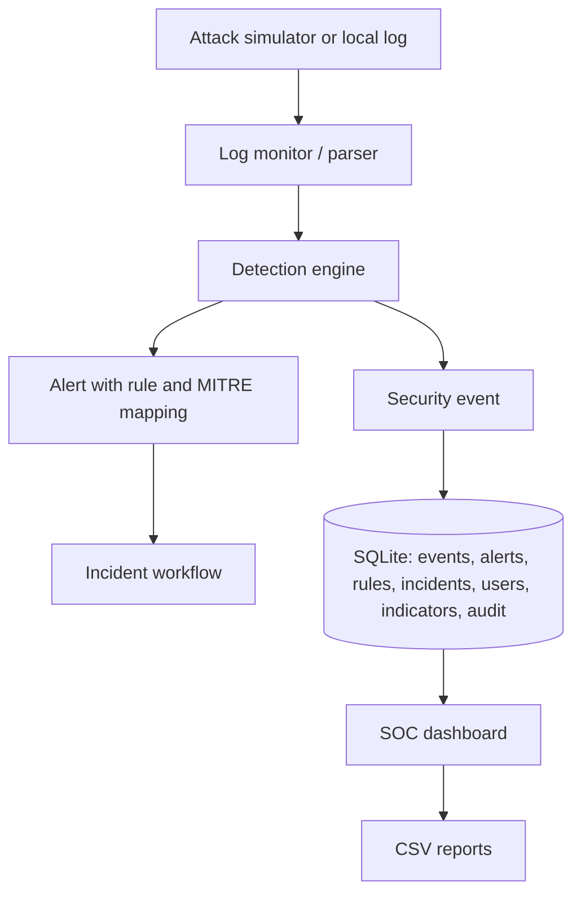

# M & M Lab Architecture

## Detection flow

1. The simulator or a local file produces an event.
2. The monitor reads only appended content and sends it to the detection rules.
3. A match creates a normalized event and alert with severity, evidence, rule ID, and MITRE ATT&CK technique.
4. Analysts investigate and update an incident status.
5. Every sensitive action is written to `activity_log`.

## Database relationships

- `events` stores raw normalized observations.
- `detection_rules` stores enabled rule metadata and ATT&CK mappings.
- `alerts` links an event to a rule and its evidence.
- `incidents` links investigations to triggering events.
- `indicators` stores local IP, domain, URL, and hash intelligence.
- `file_baselines` stores integrity monitor hashes.
- `users` stores hashed credentials and roles.
